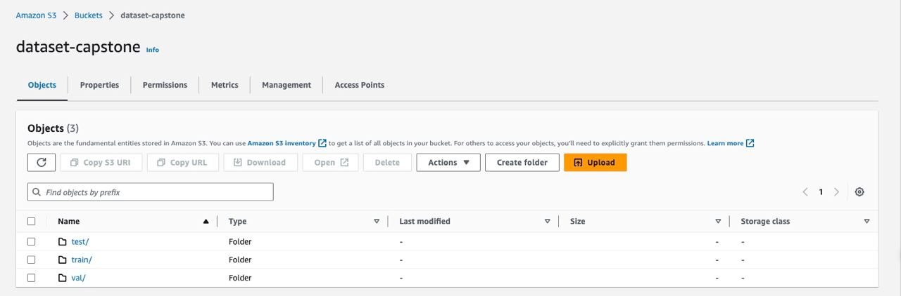

#   Inventory Monitoring at Distribution Centers

In this project, we'll work on how to count the objects in bins. Our goal is to create a pipeline with AWS tools.

**Note**: This repository relates to AWS Machine Learning Engineer nanodegree provided by Udacity.

## Project Summary
Our tasks are structured into five distinct categories:

1. Gathering data from the primary source and arranging it within an S3 bucket.
2. Conducting exploratory data analysis (EDA) on the dataset within SageMaker Studio.
3. Creating a model and optimizing its hyperparameters through SageMaker.
4. Training and assessing the model's performance using SageMaker.
5. Overseeing the management of model resources with the assistance of SageMaker Debugger.

## Environment

We utilized an AWS SageMaker instance of type `ml.t3.medium` because `ml.t3.medium` is often a good choice for a notebook instance because it offers a balance between cost and performance. The `ml.t3.medium` instance type provides a good amount of CPU and memory resources. It offers 2 vCPUs, 4 GB of memory, and moderate network performance. 

Additionally, the essential software prerequisites for the project include:
- Python version 3.10
- Transformer version 4.28.1
- Pytorch version 2.0

## Initial setup

1. Clone the repository.
2. Run [create_dataset.ipynb](./create_dataset.ipynb) to create dataset to train and evaluate
3. Run [sagemaker.ipynb](./sagemaker.ipynb) cells in order and follow its instructions!

## Data

The Amazon Bin Image Dataset contains 536,434 images and metadata from bins of a pod in an operating Amazon Fulfillment Center. The bin images in this dataset are captured as robot units carry pods as part of normal Amazon Fulfillment Center operations. This dataset has many images and the corresponding medadata.

The image files have three groups according to its naming scheme:
- A file name with 1~4 digits (1,200): 1.jpg ~ 1200.jpg
- A file name with 5 digits (99,999): 00001.jpg ~ 99999.jpg
- A file name with 6 digits (435,235): 100000.jpg ~ 535234.jpg

Sample metadata file:

You can see a sample(with 5 objects in it) of the dataset in the following picture:

We used [file_list.json](./file_list.json), a subset which is a well-balanced representative subset of the whole dataset.

## Pipeline

After splitting our dataset into train, validation, test. We can store them into S3 bucket as shown below:

You can use [train.py](./train.py) for hyperparameter tuning for benchmark and refined model, respectively. This point is similar for [train.py](./train.py) and [train_augmentation.py](./train_augmentation.py) for training and evaluation.

And finally, you can use [sagemaker.ipynb](./sagemaker.ipynb) as an orchestrator for all the mentioned above scripts to create the pipeline in SageMaker.

## Profiler Reports
The reports of the SageMaker profiler is organized in [profiler reports](./ProfilerReports/benchmark)

## Technical Reports
You can read about the introduction and development phase of the project in [proposal.pdf](./propsoal.pdf) and [report.pdf](./report.pdf).